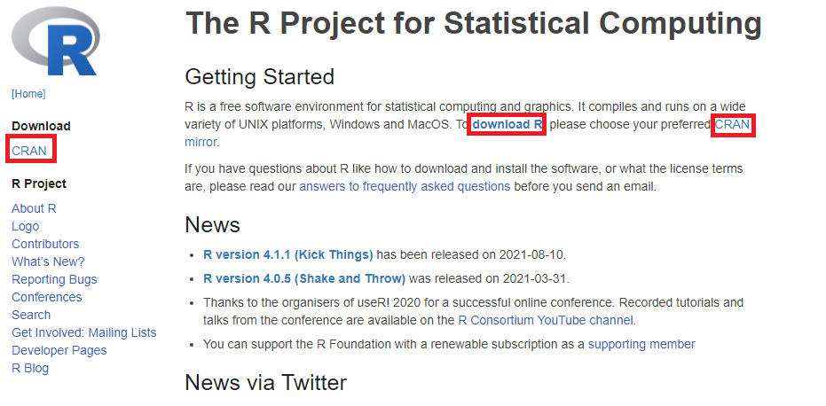
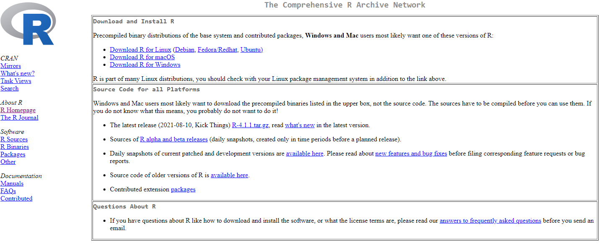
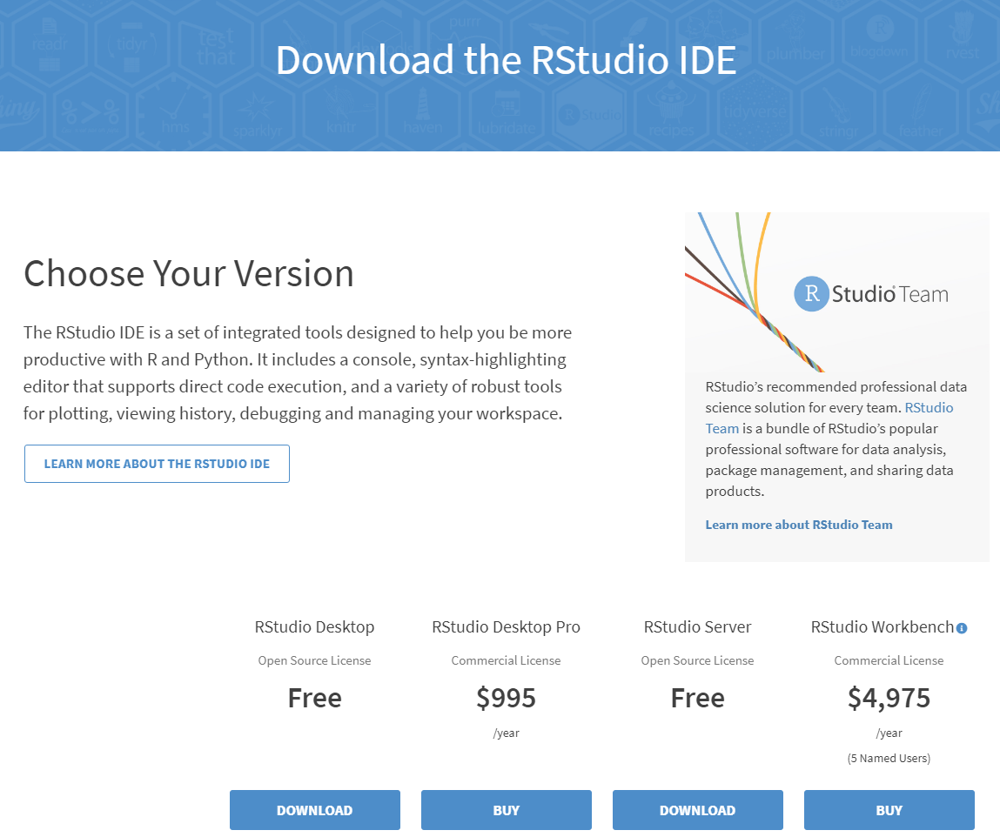
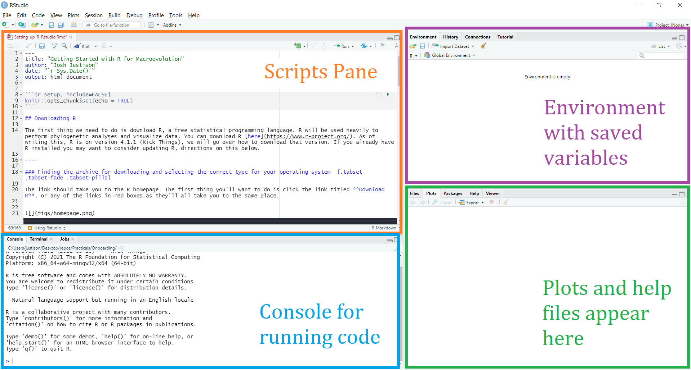

```{r setup, include=FALSE}
knitr::opts_chunk$set(echo = TRUE)
```

## Downloading R

The first thing we need to do is download R, a free statistical programming language. R will be used heavily to perform phylogenetic analyses and visualize data. You can download R [here](https://www.r-project.org/). As of writing this, R is on version 4.3.2 (Eye Holes), we will go over how to download that version. If you already have R installed you may want to consider updating R, directions on this below.

----

### Finding the archive for downloading and selecting the correct type for your operating system  {.tabset .tabset-fade .tabset-pills}

The link should take you to the R homepage. The first thing you'll want to do is click the link titled **Download R**, or any of the links in red boxes as they'll all take you to the same place.



From here you'll be taken to a page that has a list of archives that you can download R from. I would recommend choosing an archive that is close to you, there is even one at ISU! After selecting a mirror, you will be taken to this page:


You will want to click the appropriate link for your operating system. I am on a Windows machine so I would click the third link. Although the process is largely the same across operating systems, there will be separate instructions for Windows and Mac.


#### Windows

After clicking the link, I was brought to a subdirectory, on this page you should find a link titled **install R for the first time**, click that. You will then be brought to a page with a download link, that link will download an R installer titled `R-4.3.2-win.exe.` Loading the installer should bring up a prompt with the preferred language, followed by a preamble about the licence, and an installation location. I would recommend leaving the installation location as the default. In fact, you should be able to click `Next >` through all the instructions, leaving most of them with their default options. 

#### Mac

When you install for macOS, you simply need to choose the latest release and download the correct installation package for your version of macOS. After downloading the file, open the `.pkg` file and follow the instructions for installing R on your computer. 


### {-}

-----

Congrats! An up to date version of R should be installed! You should now have an R executable. If you run R you should be greeted with the message:
```
R version 4.3.2 (2023-10-31 ucrt) -- "Eye Holes"
Copyright (C) 2023 The R Foundation for Statistical Computing
Platform: x86_64-w64-mingw32/x64 (64-bit)
```
Depending on the operating system you may see different things for the `Platform:` portion. With R installed you could run through all of the tutorials for this course. However, running from the console isn't the prettiest or easiest environment and for this reason you should also download Rstudio.

## Downloading Rstudio

You can find Rstudio [here](https://www.rstudio.com/products/rstudio/download/). 




The free desktop version should be sufficient for our purposes. After clicking the download link for the free version, you will again be prompted to select the correct type for your operating system. Doing so will download an installer. You shouldn't need to change any of the default options on installation but you may want to consider adding a desktop shortcut for easy access. 

## Using Rstudio

Rstudio provides a powerful working environment for R. It can seem a bit overwhelming at first but once you get the hang of it, there's a lot you can do with Rstudio. There are four main panes that are useful to know in Rstudio. Here's what Rstudio may look like when you first open it up



In the top left there should be a pane with scripts, or code, for R. If this pane is not present you can either start a new R script or load one in by using the **file** tab on the top left of the window. If starting a new script then you would want to select **New File** and **R Script** afterwards. This pane is where we can write code to be executed and save it to a file to view later.

The bottom left pane has the console, this is where you can execute R code by typing commands after the **>** symbol. If you want to execute code from your R scripts above you can select the line you want to run and either press the **Run** button with a green arrow to the left of it or you can press Ctrl+Enter (Cmd+Enter on Macs).

The top right pane shows our environment, this has information about any variables that we may have created while running R code. You will be able to see the names of the created variables as well as some basic information such as their value, type, or size.

The bottom right pane has a few different uses depending on what you are doing. Any plots you create will appear in this corner or if you use the **?** operator before a function name, a help file will come up with details about a given function. For example, if you type `?mean()` in the console and press Enter to execute the code then a file will appear in the bottom right that gives information and usage for the `mean()` function.

We will cover some more basic details about Rstudio next week but you should also play around a bit Rstudio by pressing some of the various buttons to see what things do and how to navigate the software. Additionally you can check out the first few pages [here](https://www.jcu.edu.au/__data/assets/pdf_file/0004/1188310/R-Studio-Basics.pdf) for a bit more guidance on using Rstudio.

## Downloading and updating R packages

Throughout this course you will need to download and install packages needed to complete the tutorials. You can easily browse the available packages using the Rstudio installer. This can be found in the "Packages" panel. 

Additionally, you can install packages in the R terminal. For example, you can install the phylogenetics package `ape` using the command `install.packages("ape")`. Each tutorial will indicate the required packages. 

## Using R

Next week we will cover some R usage basics. However, it may be helpful to play around with R and get acquainted with the syntax, especially if this is your first time coding. Adam Bard has some good tutorials for various programming languages and it may be helpful to look at his tutorial on [Learning X in Y Minutes, where X=R](https://learnxinyminutes.com/docs/r/). Try running some of the code in the tutorial to get familiar with executing code and looking for outputs, or even just perusing the tutorial to see the specific syntax of R can be useful.