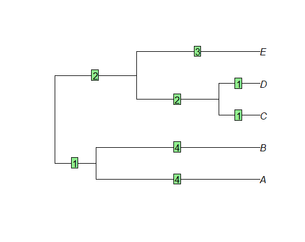

```{r setup, include=FALSE}
knitr::opts_chunk$set(echo = TRUE)
```

## Source

You can find the source files for this tutorial on the class GitHub repository:

[https://github.com/deanadams/MacroevolutionPracticals](https://github.com/deanadams/MacroevolutionPracticals)

## A Brief Introduction to R

### Motivation

R is a statistical programming environment with many built-in mathematical functions and many others that are found in packages that can be installed. 

Analyses in R are performed using a series of commands which are written in script files and passed to the main console. The general workflow is:

* 1: OPEN R
* 2: OPEN R-script
* 3: change to working directory 
* 4: run analyses

### Some basic commands

Like any programming language, one must learn its syntax. Over time one learns the commands in R, and how to string them together into meaningful operations. Here are some basic commands:

Assign a value to a variable

```{r eval=TRUE}
a <- 3
a

b = 4
b

5 -> c
c
```

Combine values into a vector (i.e., array) using the `c` function

```{r}
b <- c(3,4,5)   
b
```


Items in a vector can be accessed by calling their position using the `[]` operators. Note that the first element in a vector is assigned position `1`. 

```{r}
b[2]	
```

Combine objects into a list using the `list` function

```{r}
l <- list(number = 3, values = c(3.5, 4, 12), message = "many things can go in a list")  
l
```

Items in a list can be accessed by calling their position using the `[[]]` operator, or by calling their name using the `$` operator.

```{r}
l[[3]] 
l$message
```

<div class = "try">
### Try it out! data.frames

The `data.frame` object is another common datatype we will encounter in R. These operate much like matrices, or two dimensional vectors. data frames can also have multiple types of data in them, they can store strings of categorical variables in one and numerical data in another column. There are many ways to access elements in a `data.frame`. If we have columns with names, we can use the `$` operator to access specific columns. alternatively, we can use bracket notation to access specific, rows, columns, or a combination of the two. Using braket notation, you specify rows and columns with `[rows,column]`; if either the rows or columns are left blank then it will return all rows or columns. For example if we have a data frame saved as `my_df` then `my_df$height` would return the column named 'height' while `my_df[,2]` returns the second column and all rows since the rows portion was left blank.

1. Access the `iris` base dataset in R. It should already be loaded, you can make sure it is by typing `iris` into the console.
2. use the `head()` function to look at the first few rows of the data frame. What kind of variables are there in the data set and what kind of values do they take?
3. try making a histogram of the 'Petal.length' column using both bracket notation and the `$` operator.

</div>
<br></br>

R provides functions for generating random deviates from several different parametric distributions. For example, we can draw a single random value uniformly from the interval (0,1):
```{r}
x <- runif(1) 
x
```

The `rnorm` function lets us draw from a normal distribution. We can draw 50 values from a normal distribution with a mean of 5 and a standard deviation of 1:

```{r}
a <- rnorm(50,5,1) 
```

We can use the `plot()` function to view a simple scatter plot of values in a vector.

```{r}
plot(a)   
```

And the `hist()` function shows us a histogram of our vector

```{r}
hist(a)     
```

There are also several built-in functions that allow us to compute summary statistics of a vector:

```{r}
mean(a)
median(a)
var(a)
```

Finally, you can look at the help for any function by calling `?`

```{r}
?var
```

## Working with Trees using the _ape_ Package

The _ape_ package provides a structure for storing a phylogenetic tree, as well as basic manipulation and plotting functions. The _ape_ structure is used by most R packages which deal with phylogenetic trees, so it is important to understand it.


The first step is to install the package if it is not already

```{r eval=FALSE}
install.packages("ape")
```

and load it into the environment. _ape_ is distributed by CRAN, the main package repository for R.

```{r}
library(ape)
```

### The tree object

_ape_ provides functions for simulating random trees with a fixed number of tips, `rcoal` (for ultrametric trees) and `rtree`. These functions can be useful for testing code on a small example, which is what we are going to do here.

```{r}
tree <- rcoal(5)
```

Let's take a look at what exactly _ape_ created when we asked for a tree:

```{r}
tree
```

This tree is of class ``phylo``:

```{r}
class(tree)
```


Most phylogenetic packages require ``phylo`` objects as input.

<!-- Optional section about the details of the phylo object starts here -->

By opening the tree object in the RStudio environment panel, we can see that this object is in fact a list of several components. The list of these components can also be accessed using the `names` function.

```{r}
names(tree)
```

Following is a short description of these components and the information they contain.

 * `tree$edge` is a nx2 matrix, where each line represents an edge of the tree. The first element is the index of the node above the edge and the second the index of the node below the tree. For instance, here we can see that the first edge is between node 6 and 7:
 
```{r}
tree$edge[1,]
```

 * `tree$edge.length` is a vector of the lengths of all the edges of the tree, in the same order as the `edge` matrix. For instance, this is the length of the previous edge 6-7:
 
```{r}
tree$edge.length[1]
```


 * `tree$tip.label` is a vector of tip labels, in the same order as the index of those tips in the `edge` matrix (note that in the `phylo` format, tips are required to have indices from 1 to ntips, where ntips is the number of tips). For instance, this is the label of the tip with index 3:

```{r}
tree$tip.label[3]
```


 * `tree$Nnode` is an integer and contains the number of internal nodes of the tree.
 * optionally, there can also be a `tree$node.label` vector which contains labels for all the internal nodes, in the same order as their indices in the `edge` matrix (so if an internal node has index ntips+5, its label is at position 5 in `tree$node.label`).
 
Most of the time, it is not necessary to directly edit the structure of `phylo` objects, as the _ape_ package and others provide functions to manipulate trees.


### Reading and writing trees

In order to interface with other software, or reuse data, we need to be able to input trees from a file, and in reverse to output trees to a file.
_ape_ supports two formats for input/output of trees, the Newick and the Nexus format. Let's write our example tree to a Newick file:

```{r}
write.tree(tree, file = "newick.tre")
```

Opening the file `newick.tre` shows that the tree has been written as a Newick string. We can read that file again into the R environment:

```{r}
newick_tree <- read.tree("newick.tre")
```

Opening both `tree` and `newick_tree` in the environment panel of RStudio shows that they are indeed the same tree.
Similarly, we can write our tree to a Nexus file,

```{r}
write.nexus(tree, file = "nexus.nex")
```

as well as read it back in.

```{r}
nexus_tree <- read.nexus("nexus.nex")
```

Again, this tree is identical to the original.

<div class = "try">
### Try it out! Newick Strings

Here we have a phylogeny with branch lengths denoted in green.


1. Try writing by hand the newick string representation of this phylogeny.
2. Now try reading in this newick string using the `read.tree()` function. **HINT** you will want to put your string in the `text` argument of the `read.tree()` function. 
3. plot your tree with the `plot()` function. Does it look like the phylogeny from the image

</div>
<br></br>


### Plotting trees

Visualizing trees is another useful function provided by the _ape_ package. By default, trees are plotted as phylograms, with tip labels:

```{r}
plot(tree)
```


Other options are available, such as coloring the edges

```{r}
plot(tree, edge.color = rainbow(8))
```


or other types of plots.

```{r}
par(mfrow=c(1,2))
plot(tree, type = "cladogram")
plot(tree, type = "radial")
```


Note that many other packages extend the _ape_ function or provide their own plotting tools.

### Other useful functions

Some other _ape_ functions that can be useful are:

 * the `getMRCA` function returns the index of the most recent common ancestor of a group of tips.
 
```{r}
getMRCA(tree, c("t1", "t3"))
```

 * the `node.depth.edgelength` function calculates the depth of each node using the edge lengths.
 
```{r}
node.depth.edgelength(tree)
```


Note that these are depths, i.e. the root is at d=0. In order to obtain the times, with the present at t=0, the values need to be reversed.

```{r}
depths <- node.depth.edgelength(tree)
max(depths) - depths
```

`drop.tip` can also be a helpful function. In some cases we don't have trait data for all tips on a phylogeny and may wish a get rid of some of those tips.

<div class = "func">

<details>
  <summary> <font size="+2"> `drop.tip()` </font> </summary>
 
This function removes tips from a phylogeny. It has a couple different argument but we'll only really need to concern ourselves with two of them:


* $phy$ A phylo object
* $tip$ A vector with a single tip or many tips to be removed. The vector may either contain the node number of the tips that are to be removed or a character vector with the names of the tips that you want to remove.

</details>
</div>
<br></br>

<div class = "try">
### Try it out! Drop tips from a phylogenetic tree

Here we will use the tree that you wrote by hand in the previous section. Let's say we don't have any trait data for A or B and want to remove them for our analysis.

1. Try removing the tips by entering the tip node numbers in the `tip` argument
2. Try removing the tips by entering the tip names in the `tip` argument

Do these trees look the same? What happens to the root of the tree, is the tree the same length?

</div>
<br></br>
