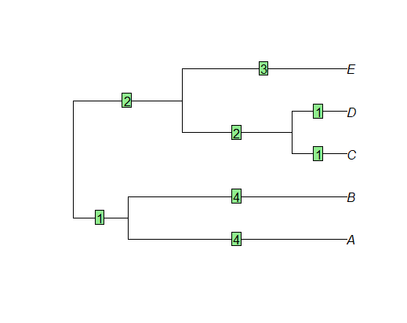
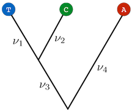

```{r setup, include=FALSE}
knitr::opts_chunk$set(echo = TRUE)
```

## Source

You can find the source files for this tutorial on the class GitHub repository:

[https://github.com/deanadams/MacroevolutionPracticals](https://github.com/deanadams/MacroevolutionPracticals)

## Working with Trees using the _ape_ Package

The _ape_ package provides a structure for storing a phylogenetic tree, as well as basic manipulation and plotting functions. The _ape_ structure is used by most R packages which deal with phylogenetic trees, so it is important to understand it.


The first step is to install the package if it is not already

```{r eval=FALSE}
install.packages("ape")
```

and load it into the environment. _ape_ is distributed by CRAN, the main package repository for R.

```{r}
library(ape)
```

### The tree object

_ape_ provides functions for simulating random trees with a fixed number of tips, `rcoal` (for ultrametric trees) and `rtree`. These functions can be useful for testing code on a small example, which is what we are going to do here.

```{r}
tree <- rcoal(5)
```

Let's take a look at what exactly _ape_ created when we asked for a tree:

```{r}
tree
```

This tree is of class ``phylo``:

```{r}
class(tree)
```


Most phylogenetic packages require ``phylo`` objects as input.

<!-- Optional section about the details of the phylo object starts here -->

By opening the tree object in the RStudio environment panel, we can see that this object is in fact a list of several components. The list of these components can also be accessed using the `names` function.

```{r}
names(tree)
```

Following is a short description of these components and the information they contain.

 * `tree$edge` is a nx2 matrix, where each line represents an edge of the tree. The first element is the index of the node above the edge and the second the index of the node below the tree. For instance, here we can see that the first edge is between node 6 and 7:
 
```{r}
tree$edge[1,]
```

 * `tree$edge.length` is a vector of the lengths of all the edges of the tree, in the same order as the `edge` matrix. For instance, this is the length of the previous edge 6-7:
 
```{r}
tree$edge.length[1]
```


 * `tree$tip.label` is a vector of tip labels, in the same order as the index of those tips in the `edge` matrix (note that in the `phylo` format, tips are required to have indices from 1 to ntips, where ntips is the number of tips). For instance, this is the label of the tip with index 3:

```{r}
tree$tip.label[3]
```


 * `tree$Nnode` is an integer and contains the number of internal nodes of the tree.
 * optionally, there can also be a `tree$node.label` vector which contains labels for all the internal nodes, in the same order as their indices in the `edge` matrix (so if an internal node has index ntips+5, its label is at position 5 in `tree$node.label`).
 
Most of the time, it is not necessary to directly edit the structure of `phylo` objects, as the _ape_ package and others provide functions to manipulate trees.


### Reading and writing trees

In order to interface with other software, or reuse data, we need to be able to input trees from a file, and in reverse to output trees to a file.
_ape_ supports two formats for input/output of trees, the Newick and the Nexus format. Let's write our example tree to a Newick file:

```{r}
write.tree(tree, file = "newick.tre")
```

Opening the file `newick.tre` shows that the tree has been written as a Newick string. We can read that file again into the R environment:

```{r}
newick_tree <- read.tree("newick.tre")
```

Opening both `tree` and `newick_tree` in the environment panel of RStudio shows that they are indeed the same tree.
Similarly, we can write our tree to a Nexus file,

```{r}
write.nexus(tree, file = "nexus.nex")
```

as well as read it back in.

```{r}
nexus_tree <- read.nexus("nexus.nex")
```

Again, this tree is identical to the original.

<div class = "try">
### Try it out! Newick Strings

Here we have a phylogeny with branch lengths denoted in green.


1. Try writing by hand the newick string representation of this phylogeny.
2. Now try reading in this newick string using the `read.tree()` function. **HINT** you will want to put your string in the `text` argument of the `read.tree()` function. 
3. plot your tree with the `plot()` function. Does it look like the phylogeny from the image

</div>
<br></br>


### Plotting trees

Visualizing trees is another useful function provided by the _ape_ package. By default, trees are plotted as phylograms, with tip labels:

```{r}
plot(tree)
```


Other options are available, such as coloring the edges

```{r}
plot(tree, edge.color = rainbow(8))
```


or other types of plots.

```{r}
par(mfrow=c(1,2))
plot(tree, type = "cladogram")
plot(tree, type = "radial")
par(mfrow=c(1,1))
```


Note that many other packages extend the _ape_ function or provide their own plotting tools.

### Other useful functions

Some other _ape_ functions that can be useful are:

 * the `getMRCA` function returns the index of the most recent common ancestor of a group of tips.
 
```{r}
getMRCA(tree, c("t1", "t3"))
```

 * the `node.depth.edgelength` function calculates the depth of each node using the edge lengths.
 
```{r}
node.depth.edgelength(tree)
```


Note that these are depths, i.e. the root is at d=0. In order to obtain the times, with the present at t=0, the values need to be reversed.

```{r}
depths <- node.depth.edgelength(tree)
max(depths) - depths
```

`drop.tip` can also be a helpful function. In some cases we don't have trait data for all tips on a phylogeny and may wish a get rid of some of those tips.

<div class = "func">

<details>
  <summary> <font size="+2"> `drop.tip()` </font> </summary>
 
This function removes tips from a phylogeny. It has a couple different argument but we'll only really need to concern ourselves with two of them:


* $phy$ A phylo object
* $tip$ A vector with a single tip or many tips to be removed. The vector may either contain the node number of the tips that are to be removed or a character vector with the names of the tips that you want to remove.

</details>
</div>
<br></br>

<div class = "try">
### Try it out! Drop tips from a phylogenetic tree

Here we will use the tree that you wrote by hand in the previous section. Let's say we don't have any trait data for A or B and want to remove them for our analysis.

1. Try removing the tips by entering the tip node numbers in the `tip` argument
2. Try removing the tips by entering the tip names in the `tip` argument

Do these trees look the same? What happens to the root of the tree, is the tree the same length?

</div>
<br></br>

## Estimating trees in R

This lesson is based on a tutorial written by Klaus Schliep entitled "[Estimating phylogenetic trees with phangorn](https://rdrr.io/cran/phangorn/f/inst/doc/Trees.pdf)". 

To estimate a phylogeny from DNA sequences, we will use the package [_phangorn_](https://github.com/KlausVigo/phangorn).

```{r eval=FALSE}
install.packages("phangorn")
```

```{r}
library(phangorn)
```

Note that this is one of the few R packages for estimating phylogenies. Typically, researchers use other tools for this like RAxML, BEAST2, IQTree, RevBayes, PAUP*, etc. These software tools are developed as stand-alone programs and most are not accessible in the R environment. The purpose of this lesson is to walk you through how to estimate a phylogenetic tree using maximum likelihood for a simple dataset. With larger datasets, it is much more practical to use a tool that is actively developed for difficult phylogenetic problems. 

### Data File

We will use a common example dataset of 12 species of primates plus two outgroups (cow and mouse). This alignment was assembled by Dr. Masami Hasegawa of the Institute of Statistical Mathematics in Tokyo, from sequencing done by Kenji Hayasaka, Takashi Gojobori, and Satoshi Horai (Molecular Biology and Evolution 5: 626-644, 1988). For more details, see [J. Felsenstein's website](http://evolution.gs.washington.edu/gs570/2016/#data).

Download the data file using R:

```{r}
download.file("https://raw.githubusercontent.com/EEOB-Macroevolution/EEOB565X-Spring2020/master/practicals/01-intro-to-phylo/primates.dna","primates.dna")
```

This will download the file `primates.dna` into your current working directory. Now we can read in the file using the function `read.phyDat()`.

```{r}
primates <- read.phyDat("primates.dna", format = "interleaved")
primates
```

### Parsimony 

To begin, we will first estimate a tree using parsimony. To perform a heuristic search under parsimony, we can start with a tree built using a random-addition algorithm.

```{r}
primates_start_tree <- random.addition(primates)
```

First let's check the parsimony score of our starting tree using the `parsimony()` function:

```{r}
parsimony(primates_start_tree, primates)
```


Now let's plot the tree.

```{r}
plot(primates_start_tree)
```

You will notice that the tree does not have meaningful branch lengths. We can represent the branch lengths in units of the number of changes (under parsimony) using the `acctran()` function. 

```{r}
primates_start_tree <- acctran(primates_start_tree, primates)
```

The tree should now be depicted as a phylogram where the branch lengths correspond to the number of state changes along a branch.

```{r}
plot(primates_start_tree)
```

Now we can optimize the tree topology under parsimony using the `optim.parsimony()` function. This performs a series of tree rearrangements under NNI. 

```{r}
primates_opt <- optim.parsimony(primates_start_tree, primates)
primates_opt <- acctran(primates_opt, primates)
```

What is the parsimony score of the optimized tree?

```{r}
parsimony(primates_opt, primates)
```


Plot the optimized tree:

```{r}
plot(primates_opt)
```

What is different between the starting tree and the optimized tree?

### Maximum Likelihood

Compute the likelihood of the parsimony tree and parsimony branch lengths. For this we use the `pml()` function of _phangorn_. By default, this approach computes the likelihood under the Jukes-Cantor (1969) model:

```{r}
fitJC <- pml(primates_opt, data=primates)
```

The object `fitJC` contains the parameter estimates and likelihood of the JC model given the data and the tree topology and branch lengths we estimated under parsimony. We can view these values by calling the variable:

```{r}
fitJC
```

We do not want to rely on parsimony for the tree topology and branch lengths, but this tree provides a reasonable starting place. We can use the `optim.pml()` function to optimize the tree and model parameters under JC69. This will perform NNI tree rearrangements to identify the topology that maximizes the likelihood.

```{r}
fitJC <- optim.pml(fitJC, optNni=TRUE)
plot(fitJC$tree)
```

If we want to optimize the tree using a different model like GTR, we can use the `pml` object as an argument and specify the `GTR` model.

```{r}
fitGTR <- optim.pml(fitJC, model="GTR", optNni=TRUE)
plot(fitGTR$tree)
```

We can try to reroot the tree using the two outgroup taxa. However, this will return an error if the outgroup is not monophyletic.

```{r error=TRUE}
GTR_tree_rooted <- root(fitGTR$tree,c("Bovine","Mouse"))
```

View the details of the `fitGTR` object. What is the log-likelihood?

```{r}
fitGTR
```

How are the two trees different? What are possible reasons for this ?

One thing that may be bothering you is how do you decide if you should analyze your data under JC69 or under GTR. One option is to compare the models statistically. You can use a likelihood ratio test to compare the two models.

```{r}
anova(fitJC, fitGTR)
```


The results of this comparison show that GTR (model 2) is best supported. 

## Calculating the Likelihood of a Tree

In the lecture, you were given the optional challenge to calculate the likelihood of the tree pictured below assuming equal branch lengths and the JC69 model. The next part of this lesson will be to do this in R. 





For a detailed explanation, you can see Josh Justison's solution to the challenge problem here: [https://jjustison.github.io/tree-likelihood](https://jjustison.github.io/tree-likelihood/)
