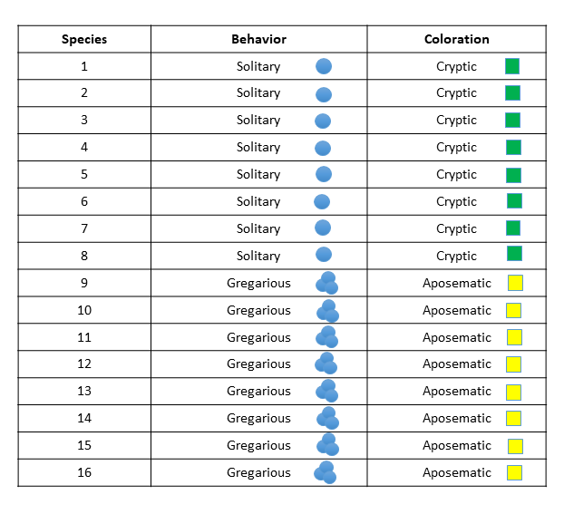
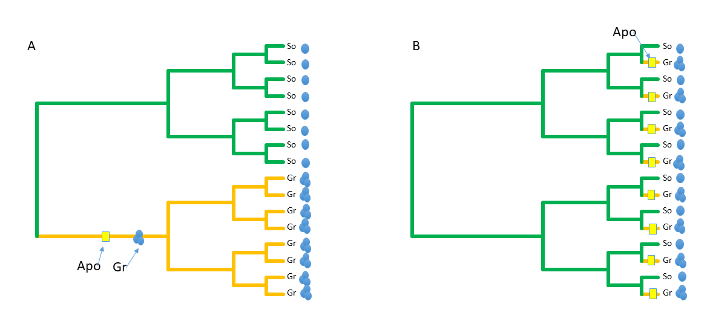
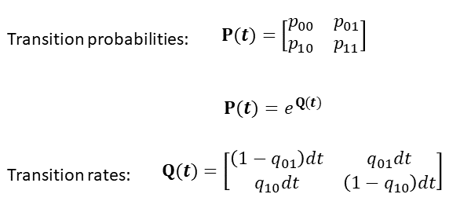
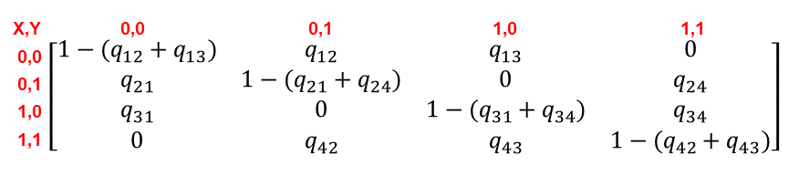
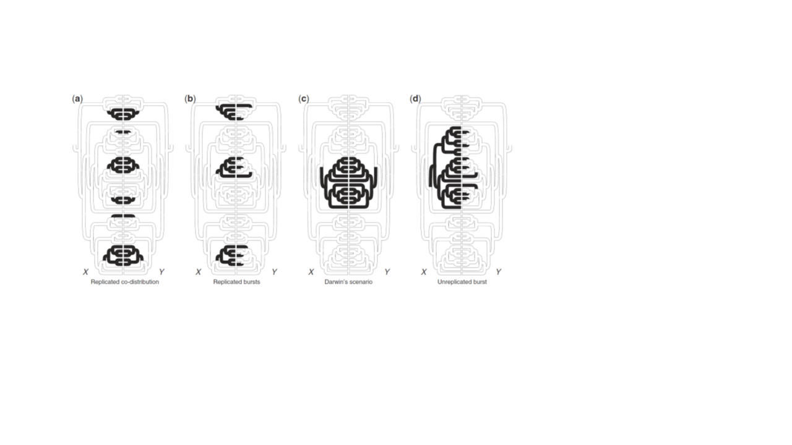

```{r,echo=F}

knitr::read_chunk('PhyloAssocDiscrete.R')

```


### **Overview**
This tutorial is intended to describe how we investigate correlated trait evolution, through methods that examine trait associations between discrete traits. Conceptually, the challenge is to identify associated shifts in two discrete traits while accounting for phylogenetic non-independence (i.e., conditioning the data on the phylogeny). For trait associations between discrete changes, we use likelihood or Bayesian approaches. For continuous traits (described next time), we use  one of several implementations of phylogenetic generalized least squares.  

### Learning Objectives

* Understand the format of rate matrices and how they're used to model discrete characters
* Be able to set up an 'equal rates' and 'all rates different' rate matrices for single and multiple traits
* Know how to alter the initial rate matrices for creating alternate hypotheses
* Fit models and interpret results in terms of the biological question 
* Compare the fit of various models using AIC or log likelihoods

### Download data files
To run the analyses in this tutorial, please download the following files from our Git-course repository: 

[Phylogeny](https://github.com/deanadams/MacroevolutionPracticals/blob/main/09-Phylo_Assoc_Discrete/data/tree.64.tre)

[Data](https://github.com/deanadams/MacroevolutionPracticals/blob/main/09-Phylo_Assoc_Discrete/data/DiscreteData.csv)

Additionally, The R-script for running the code found in this tutorial is found here:

[RScript](https://github.com/deanadams/MacroevolutionPracticals/blob/main/09-Phylo_Assoc_Discrete/scripts/PhyloAssocDiscrete.r)

As before, on your local computer, place them in a folder named 'TutorialData', which is found in the same directory as this tutorial. 


#### **Conceptual Background**
Recall that in macroevolutionary studies, we are often interested in determining how two or more traits covary across a broad set of taxa. For continuous variables, this is a 'regression' problem: we statistically quantify the degree of covaraition between Y and X while accounting for the phylogenetic relationships among species. If a significant relationship is observed, we can conclude that there is an evolutionary association between Y and X, which may be due to some biological factor of interest (e.g., natural selection, adaptation, etc.).

As evolutionary biologists we may wish to ask very similar questions when our phenotypic data are not continuous, but are instead discrete. For example, we may have species with two color 'states': aposematic or cryptic. And these same species may be classified behaviorally as either solitary or gregarious.  An interesting evolutionary question would be: Is there an association between behavior and coloration?  Put another way, are cryptic species more often solitary, and aposematic more gregarious? From the data in Fig 1., we may wish to test this hypothesis statistically.



One might be tempted to simply perform a Chi-square test on these data. However, this ignores evolutionary history, and how these are distributed on the phylogeny can make an enormous difference! In case 1 (Fig. 2A) the traits are clustered in two sub-lineages, implying that a single evolutionary transition in each trait could have caused our pattern. This is not overly impressive evolutionarily, as it represents an $N=1$ case.  On the other hand, case 2 (Fig. 2B) shows many independent associated changes of the two traits. This is far more impressive. Clearly, taking phylogeny into consideration is absolutely essential for correct biological inference.  




### **Bringing Data into R**


<div class = "try">
### Reading in the Data

Before we perform our comparative analysis we must read in our data and our phylogeny into R, and 'link' them up by pruning them relative to one another so that all taxa in the tree are found in the data matrix and vice versa. Recall that for this to work properly, the rownames of our data matrix (or 'names' of a vector if a single variable) must match the names of the taxa at the tips of the phylogeny. These are found as: `phy$tip.label`. It may be helpful to view previous tutorials if you need help reading in and matching data.

1. Load the `geiger`, `phytools`, and `corHMM` package with `library()`.
1. Use `read.tree()` to read in the tree titled `tree.64.tre`. This file can be found in the data folder of this tutorial
2. Use the `read.csv()` function to read in the discrete trait data called `DiscreteData.csv`
3. Use `treedata()` to match the phylogeny tips to the trait data. Be sure to set the `sort` argument to `TRUE`.
4. Assign the matched tree to a new variable called `tree` and the matched data to a new variable called `mydata`. The remainder of the tutorial will assume these variable names for the phylogeny and data frmae with traits, respectively. 

Be sure to get a feel for the phylogeny (use `plot()`) and the data (`head()` can be useful here)! It is always nice to know the data we are working with before jumping into analyses.

</div>
<br></br>

```{r,read_data, eval=T,echo=F,results='hide'}
```

It can also be helpful to plot the trait data on the tree to help visualize various scenarios. Here we are going to plot two traits side by side, `V1` and `V3`. We can see that both of these traits are binary as they only consist of $1$ and $0$. We'll plot each of the states a different color for the trait. There are a lot of ways to plot traits on a tree, we'll be using `tiplabels()` to get the job done

```{r,plot_data,eval=TRUE}
```


<div class = "func">

<details>
  <summary> <font size="+2"> `tiplabels()` </font> </summary>
 
This is a general plotting function for the tips of a plotted phylogeny
`tiplabels()` has many different arguments, it can be helpful to look at the help `?tiplabels` to learn more. We'll just be going over the 3 arguments used for plotting the discrete character data:


* $col$ This is a vector that specifies which color each point is. If only one color is provided then all points will be made that color. If nothing is given then the color will default to black
* $offset$ this is a number that plots the points further away from the tips. This is helpful for when we want to plot multiple traits. Had we not have used offset on the second trait then it would have plotted on top of the first
* $pch$ This argument is a numeric that specifies the shape drawn for the trait. You can a table of shapes and their corresponding numbers [here](https://r-charts.com/base-r/pch-symbols/). One can also provide a vector of numbers to make each point a different shape. If wanted we can actually utilize this fact to make plot traits such that each state is a different shape by using the same tricks we did for colors. See below for an example
* $cex$ this is a numeric that acts as a scalar for the size of the shape being drawn. If nothing is provided, this defaults to `1`

```{r,eval=F}

shapekey <- c(17,19) ##triangles and circles
 
names(shapekey) <-c(0,1) ##0s get triangles and 19 get circles
shapes<-shapekey[as.character(mydata[,1])] ##putting the trait values in as.character() is important!
plot(tree,show.tip.label = F)
tiplabels(pch=shapes)

```

</details>
</div>
<br></br>

### **Phylogenetic Analysis of Discrete Characters**
#### 1: Single trait analysis: transition rate comparison
One component of phenotypic pattern that differs between discrete and continous traits concerns transition rates. With continuous data, we envision trait change following Brownian motion, where changes in trait values are independent from time step to time step, both in terms of their magnitude (how much change), and their direction (positive or negative change relative to the previous step).  For discrete traits, one can also model trait change that way, and in fact several models do so based on MCMC properties (which also the discrete-form of a Brownian motion process). However, because there are a finite number of states, one can ask additional questions about pattern.

For instance, is the rate of change from state $A \rightarrow B$ greater than the rate of change 'back' from $B \rightarrow A$? This question has little meaning for continuous traits, but could be very important for discrete traits. These values are embodied in the transition rate matrix **Q**, which is obtained from the estimated probability matrix (Fig. 3). Derivation of these matrices is described in Pagel (1994). 



From these we can pose a question and test a hypothesis:  Is the evolutionary transition rate from state $A \rightarrow B$ the same as the transition rate from $B \rightarrow A$? Evaluating this hypothesis requires fitting two evolutioanry models to the data: one where the rates (qAB, qBA) are equal, and one where the two rates are allowed to vary. The fit of these models may then be evaluated using likelihood ratio tests (LRT), AIC values, or some other statistical approach. Below is an example. We'll be using `getStateMat4Dat()`  to create our matrix of state transitions and `corHMM()` to fit various models of discrete trait evolution.


<div class = "func">

<details>
  <summary> <font size="+2"> `getStateMat4Dat()` </font> </summary>
 
This creates a rate matrix for the data to describe the discrete character evolution. It has the following parameters:


* $data$ a data.frame containing species information. The first column must be species names matching the phylogeny. Additional columns contain discrete character data. There will be an example of how to format trait information to this format below
* $model$ One of "ARD", "SYM", or "ER". ARD: all rates differ. SYM: 'symmetric' rates between any two states do not differ (i.e $A\rightarrow B$ equals $B\rightarrow A$). ER: all rates are equal.

This function returns a list of objects:

$\$legend$	A named vector. The elements of the vector are all the unique state combinations in the user data. The names of the vector are the state number assigned to each combination.

$\$rate.mat$	A rate index matrix describing a single rate class. This is the element we'll use in `corHMM()`.


</details>
</div>
<br></br>


```{r,single_trait, eval=TRUE}
```

We can then view the models we made by simply typing out the variables. We can see the matrix of transitions in the $\$rate.mat$. Numbers that are the same refer to those transitions having the same rate and $0$ denotes a transition that never occurs. We can see the states the column and row numbers refer to by looking at $\$legend$. 

We can also use `plotMkmodel()` to make a ball and stick visualization of the transition matrix.

```{r, single_trait_plot,eval=T,warning=F}
```

After assessing that we've set up the models we wanted we can fit and compare the models with `corHMM()`


<div class = "func">

<details>
  <summary> <font size="+2"> `corHMM()` </font> </summary>
 
This function fits a model of discrete character evolution. This function has many parameters but we'll be using the following ones:

* $phy$ a phylo object
* $data$ a data.frame containing species information. The first column must be species names matching the phylogeny. Additional columns contain discrete character data.There will be an example of how to format trait information to this format below.
* $rate.cat$ The number of rate categories. For our purposes, we should put `1`. Numbers greater than `1` will create hidden rate categories.
* $rate.mat$ A matrix of parameters to be optimized. This specifies our model for trait evolution. We will be using the output from `getStateMat4Dat()` here.

This function returns the fit model with parameter estimates and summary statistics. Some elements of interest are:

* $\$loglik$ the maximum negative log-likelihood.
* $\$AIC$ Akaike information criterion.
* $\$AICc$ Akaike information criterion corrected for sample size.
* $\$solution$ a matrix containing the maximum likelihood estimates of the transition rates. Note that the rate classes are ordered from slowest (R1) to fastest (Rn) with respect to state 0.
* $\$index.mat$	The indices of the parameters being estimated are returned. This also is a way to allow the estimation of transition rates for parameters not observed in the data set. Say you have 2 binary traits X and Y, where the combinations 00, 01, and 11 are observed (10 is not). A 4 by 4 index matrix could be used to force 10 into the model.

</details>
</div>
<br></br>

```{r,single_trait_fit,eval=T}
```

First, we can see that both models came to roughly the same transition rate estimates. This would explain why the log likelihoods are markedly similar between the models. As a rule of thumb, when log likelihoods are *sufficiently* similar we chose the less complex model. Indeed, when we look at AIC scores that factor in model complexity we see a better score for the equal rates model. The comparison reveals that the more complex model (different rates) is *not* a better fit as compared to the simpler model (equal rates). Thus, one would conclude that the rate of change from state $A \rightarrow B$ is equivalent to the rate of change from $B \rightarrow A$ for these data. 

<div class = "try">
### Try it out! Which model is best?

Let's analyze traits 2 and 3 as well to assess whether an equal rates model or all rates different model best describes the data. Specifically, for both traits 2 and 3:

1. plot the data on the tree. This is always a good first step to make sure things are loaded in correctly and it can help provide intuition.
    + From looking at the trait data plotted would you expect the transition rates to differ and if so, which to do you expect to be higher?
2. create two transition matrices for the data, one `ARD` model and a `ER` model
3. fit the models using `corHMM()`

Which model fits better in each scenario? What are the transition rates of the better fitting models? What would you say about the evolution of the traits?

</div>
<br></br>


#### 2: Two trait analysis: Trait association
Having examined questions concerning rates of change between states of a single trait, we can now return to the question of correlated evolution. Here we wish to know whether two traits are associated phylogenetically. For continuous traits, this is akin to phylogenetic regression or correlation. However, for discrete traits, this question becomes one of evaluating transition rates between sets of trait changes.  

In essence, this is a generalization of the rate matrix for a single trait, only now we consider two traits. Here, we have a 4 X 4 rate matrix describing the transition rates between character states for 2 traits  (Fig. 4). We can see some zeros in the rate matrix for certain transitions, this is because we assume that only one trait changes at a given time (We assume $0\_0 \leftrightarrow 1\_1$ or $0\_1 \leftrightarrow 1\_0$ never occurs). 



To evaluate trait associations we now fit two models. The first is our 'independent' model. Here transition rates are the same regardless of trait state (in other words, the rate is independent of the row or column in the matrix). For binary traits, we can specify an 'independent mode' by giving equal rates across the matrix. 

The second model is describes correlated (dependent) trait evolution. Here the trait changes depend on the initial state. This model has more free parameters, as all transition rates are permitted to differ from one another. One then fits the data to the phylogeny under this second model. 

We create and fit the models just like we did for the single trait case, however, this time our data frame will contain two traits instead of just one.

```{r,two_trait, eval = T,warning=F}
```

We have two traits so we should have a $4\times4$ transition matrix but we don't see that when visualizing, why not? This actually has to do with something sneaky that happens when we make our transition matrix. Since the states of two traits match each other perfectly in that we only ever see $0\_1$ or $1\_0$, the two traits effectively get collapsed into one combined trait with two states. We can fix this issue by making our function think all four trait combinations are present

```{r,two_trait_fixed,eval=T}


```

Neat-o! The matrix seems set up with all character states present. Now we could continue fitting the model exactly as we did before and comparing the log likelihoods and AIC scores. Additionally we can try Pagel's test for correlated trait evolution.

```{r,two_trait_pagel,eval=T}
```
    
Pagel's test finds high evidence for correlated evolution but this could be spurious if there are very few evolutionary transitions of the traits! In this case, there is 1 evolutionary shift that could explain the pattern (thus, the co-evolution is less spectacular). This is the same as the 'BiSSE' problem we will discuss in a future lesson.  **ALWAYS PLOT YOUR DATA! DON'T JUST RUN STATISTICS (statistical analysis alone in this case could leads to misinterpretation)**


#### 3: Two trait analysis: Directional tests
Sometimes we have evolutionary hypotheses that require directionality:  "Did the evolution of aposematic coloration precipitate the evolution of gregariousness?" To answer such questions, one must create a model where changes in one trait facilitate changes in another trait. This entails alteration of components in the expected rate matrix $Q$. For example, we could test the scenario where rates in "X" depend on "Y" or where rates in "Y" depend on "X". There are easily performed in `phytools` using `pagelFit`: 

```{r,x_dep_y_fit,eval=T}
```

```{r,y_dep_x_fit,eval=T}
```

For this particular example, the results are not overly informative, as there is a perfect association between our traits. But the code illustrates one manner in which such analyses can be performed. 

<div class = "try">
### Try it out! Which model is best: correlated evolution

The gold-standard package for such analyses is `corHMM`. This package allows two trait correlation analyses as per above, but one can also specify specific hypotheses of rate changes to investigate. To show how, let's analyze traits 3 and 4 to see whether they evolve independently or evolve in a correlated fashion Try the following:

1. plot the data on the tree. This is always a good first step to make sure things are loaded in correctly and it can help provide intuition.
    + From looking at the trait data plotted, would you guess that the traits evolve in a coordinated manner? Why or why not?
2. create two transition matrices for the data, one `ARD` model for correlated evolution and an `ER` model for 'independent' trait evolution. **NOTE:** you may have to coax the matrix maker into thinking all state combinations are present since we don't see all character state combinations present.
3. fit the models using `corHMM()`
4. compare the log likelihoods and AIC scores between the two models, which model seems to fit better? **NOTE** if you wanted to do a formal likelihood ratio test as shown above, there would be 4 degrees of freedom, not 1. 

Which model fits better in each scenario? What are the transition rates of the better fitting models? What would you say about the evolution of the traits?

Here we are more inclined to interpret this result evolutionarily, as there are now many independent evolutionary shifts contributing to the observed correlated pattern (see Maddison and FitzJohn 2015: also Fig. 5 below).



</div>


#### 3: Two trait analysis: Directional tests
Sometimes we have evolutionary hypotheses that require directionality:  "Did the evolution of aposematic coloration precipitate the evolution of gregariousness?" To answer such questions, one must create a model where changes in one trait facilitate changes in another trait. This entails alteration of components in the expected rate matrix $Q$. For example: 

```{r,two_trait_order, eval=TRUE}
```

In this case, the equal rate model is the null, whereas the directional rate model is the alternative. For this example, we are explicitly testing the hypothesis that shifts in trait $Y$ from $0\rightarrow1$ are facilitated by trait $X$ being in state $0$, because we are allowing $Q(0\_0\rightarrow 0\_1) \neq  Q(1\_0\rightarrow1\_1)$. In other words, evolutionary shifts to state $1$ for $Y$ are different, depending on whether $X$ is a state $0$ or a state $1$.  

**IMPORTANT!** One must think carefully about the hypothesis under investigation to properly adjust the alternative model to represent it!! Thinking is not only encouraged; it is required. 

Example with traits 3 and 4

```{r,two_trait_plot, eval=TRUE,echo=F}

```

```{r,two_trait_dir_fit}

```

Here we see that there is strong support for directional dependent evolution. That is, evolutionary changes in Y from $0 \rightarrow 1$ depend upon the state of X (here, X must be a '1' for the transition to occur).

### Trait Evolution in Porgs

[Porgs](https://www.youtube.com/watch?v=tNtNIqL8omc) of the Star Wars Universe are small sea-dwelling birds that are native to the planet [Anch-To](https://starwars.fandom.com/wiki/Ahch-To). They are a hypercurious species that roosts on cliffs and evolved from seabirds.

Many porg species differ by their presence of webbed feet. These webbed feet help the porgs navigate water better and allow them to hunt many different types of sea creatures. Their land dwelling unwebbed-foot relatives typically have fewer niches to exploit as the terrestrial portions of Anch-To are largely devoid of life. These porgs typically rely on eating bugs in small crevices between rocks. 
Additionally, some porg species have long proboscis-like beaks while others are entirely beakless. Porgs use their beaks to spear fish or reach food in narrow spaces. The beakless porgs use their lack of beak to fit various crustaceans in their strong mouths, cracking their hard exteriors for sustenance.   


<div class = "try">
### Try it out! Porg Discrete Character Evolution

Let's analyze the evolution of beaks and webbed feet in porgs. Specifically, we might be interested in the transition rates between states. Do we see equal rates? Do we see transitions in both directions? Does having webbed feet seem to change the dynamics of transitioning between beaked state and a beakless state?


1. Load the porg phylogeny and trait data.
    + [Porg Tree](https://eeob-macroevolution.github.io/Practicals/Phylo_Assoc_Discrete/data/porg.tre)
    + [Porg Data](https://eeob-macroevolution.github.io/Practicals/Phylo_Assoc_Discrete/data/porg_data.csv)
2. plot the data on the tree.
    + From looking at the trait data plotted, would you guess that the traits evolve in a coordinated manner? Why or why not?
    + Does it look like there are repeated instances of the various transitions? Do we have psuedoreplication issues?
3. create two transition matrices for the data, one `ARD` model for correlated evolution and an `ER` model for 'independent' trait evolution.
4. fit the models using `corHMM()`
5. compare the log likelihoods and AIC scores between the two models, which model seems to fit better? 

Now try fitting a directional character evolution model. How can we use information about their life strategies to inform a directional model? Would we expect to see webbed porgs to transition to a beakless state at the same rate as unwebbed porgs? Would it seem likely that an unwebbed porg with a beak would transtion to a beakless state? 

6. Fit a directional character evolution model by altering the rate matrix by either setting some rates to $0$ or by making new rate categories. Be sure to explain why you created your model.

Which model fits better in each scenario? What are the transition rates of the better fitting models? What would you say about the evolution of the traits?

</div>
